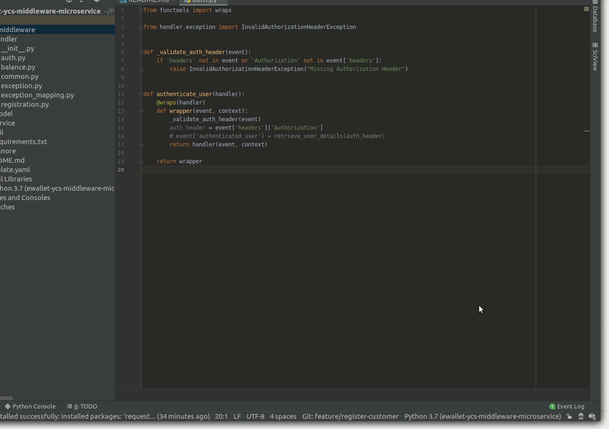
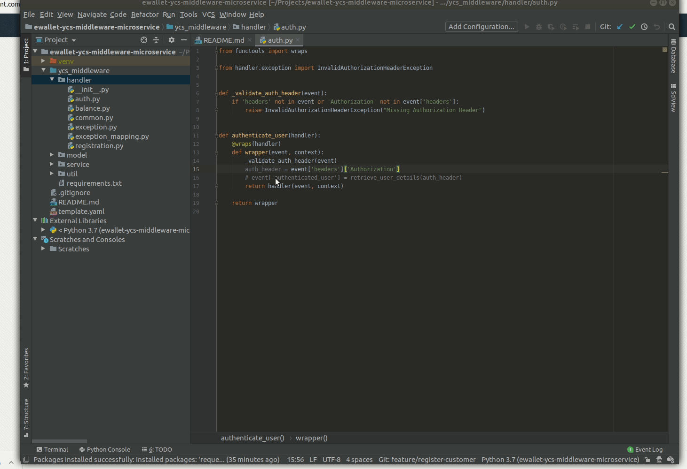
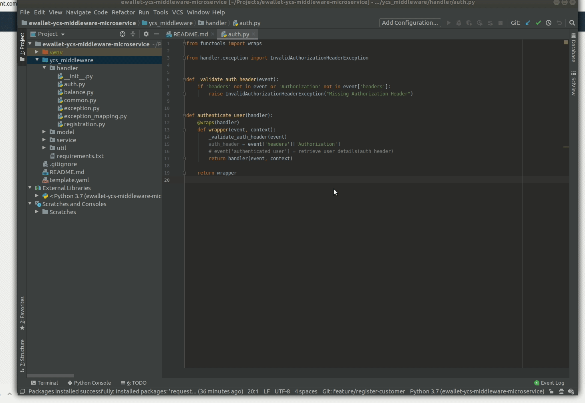

# [TIL: 12/9/2019]

### - PyCharm additional steps after importing a new project
#### Set project interperter

#### Set dependencies for local environment

#### Mark source root directory

### - Business Knowledge
#### CBS contains user details
#### YCS is the service that we use for e-wallet management
#### PearlPay E-Wallet is the app that serves as a front end for YCS and CBS
